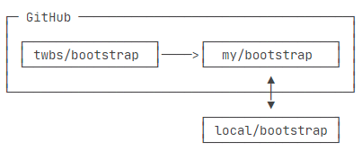

# 架构


stage：暂存区

master：默认主分支

HEAD指向当前版本

Git 跟踪并管理修改，而非文件

# 常用命令

> git log：回车下滚一行、空格下滚一页、q退出

初始化 git 仓库 repository:

```sh
git init
```

添加文件到仓库:

```sh
git add readme.txt
```

提交文件到仓库:

```sh
git commit -m "wrote a readme file"
# -m 后面输入的是本次提交的说明
```

# 版本管理

> HEAD指向当前版本
>
> 穿梭前，用git log 查看提交历史，以确定回退版本
>
> 要重返未来，用git reflog 查看命令历史，以确定回到未来的版本

### 查看工作区状态 -- 简

```sh
git status
```

### 查看修改内容

```sh
git diff readme.txt
# 查看difference，显示格式为Unix通用的diff格式
```

### 查看提交日志

```sh
git log
# 显示从最近到最远的提交日志，可以看到3次提交
# 如果嫌输出信息过多，可以加上 --pretty=oneline 参数
```

### 版本回退

```sh
git reset --hard HEAD^
# HEAD表示当前版本，HEAD^是上一个版本，往上n个版本为 HEAD~n
# --hard 参数
```

### 回到指定版本

```sh
git reset --hard 1094a
# 1094a为该版本的commit id前几位
```

### 查看命令记录

```sh
git reflog
```

### 撤销修改

```sh
git checkout -- readme.txt
# 两种情况：1.修改后没add到暂存区 => 回到版本库状态
#		  2.已在暂存区，又修改  => 回到暂存区修改前状态

# in all: 会回到最近一次 git commit 或 git add时状态
# 命令中的 -- 很重要
```

```sh
git reset HEAD readme.txt
# 把暂存区的修改撤销，重新回到工作区
```

### 删除文件

> 删除 rm 和添加 add 都属于同类型操作，对工作区、暂存区、版本库的影响相同，都是一种 “修改”

```sh
git rm test.txt
git commit -m "remove test.txt"
```

```sh
# 如果误删
git checkout -- test.txt
# git checkout 用版本库里的版本替换工作区的版本
```


# 远程仓库

> 第一次使用 Git clone/push 时会出现SSH警告

### 关联远程仓库

```sh
git remote add origin git@github.com:xxx/xxx.git
# 添加后，远程库的名字就是origin，这是Git默认叫法，也可以更改
```

### 拉取远程库

```sh
git pull origin dev
# 拉取远程库origin的dev分支
```


### 推送到远程库

```sh
git push -u origin master
# 把当前分支master推送到远程库，
# -u把本地master和远程master关联起来，只用关联一次
git push origin local_branch_name:remote_branch_name
# 推送本地分支到指定远程分支
git push origin b_name
# 推送分支到对应远程分支
```

### 查看远程库信息

```sh
git remote -v
```

### 删除远程库

```sh
git remote rm origin
# "删除"为解除本地和远程绑定关系
git push origin -d dev
# 删除远程分支
```

### 从远程库克隆

```sh
git clone git@github.com:xxx/xxx.git
# 会直接克隆到以仓库名为名的文件夹里
# ssh协议速度最快
```

### 建立本地和远程分支关联

```sh
git branch --set-upstream b_name origin/b_name
```


# 分支管理

> 分支之间的跳转，需要保证该分支下工作区、暂存区域分支提交相同，无修改。即 git diff HEAD 无差异


### 创建分支

```sh
git branch dev
```

### 切换分支

```sh
git checkout dev
git switch dev	# 推荐
```

```sh
git checkout -b dev
git switch -c dev	# 推荐
# 上两步简写，创建并切换到dev
```

### 查看分支

```sh
git branch
```

### 合并分支

```sh
git merge dev
# 合并dev到当前分支
# 如果合并产生冲突，使用git status找到冲突文件，修改后保存提交，解决冲突后自动合并
git log --graph --pretty=oneline --abbrev-commit
# 使用带参数的git log可以查看分支合并情况
```

```sh
git log --graph
#查看分支合并图
```

> 合并分支时，Git会使用 Fast forward模式，在这种模式下，删除分支后，会丢掉分支信息

```sh
git merge --no-ff -m"merge with no-ff" dev
# --no-ff：禁用 Fast forward 模式
# 这里的-m，因为本次合并要创建一个新的commit，所以加上-m
```


### 删除分支

```sh
git branch -d dev
```

### Bug分支

```sh
git stash
# 暂存工作现场
```

```sh
git stash list
# 查看stash列表
```

```sh
git stash pop
# 恢复并删除该stash
```

```sh
git stash apply stash@{0}
# 恢复指定的stash
```

```sh
git cherry-pick commit_id
# 复制一个特定的提交到当前分支
```

### Feature分支

> 开发一个新feature，最好新建一个分支

```sh
git branch -D b_name
# 强制删除一个没有被合并过的分支
```

### 多人协作

> 推送远程库失败，可能是远程库有更新，先pull拉取，再解决冲突commit并push

```sh
git checkout -b dev origin/dev
# 创建远程origin的dev分支到本地
git switch -c dev origin/dev
```

```sh
git pull origin dev
# 拉取远程库origin的dev分支
```

### Rebase

> 把杂乱的分支整理为一条直线

```sh
git rebase
```


# 标签管理

> 标签总是和 commit 挂钩，如果该 commit 既出现在 master 分支，又出现在 dev 分支，则两个分支都可以看到该标签

> 标签是指向commit的死指针，分支是指向commit的活指针

### 创建标签

```sh
git tag v1.0
# 默认打在当前分支的最新commit上
```

```sh
git tag v0.9 commit_id
#git log查找commit_id，然后在该id上打tag
```

```sh
git tag -a v0.1 -m "version 0.1 released" commit_id
# -a指定标签名，-m指定说明文字
```

### 查看标签

```sh
git tag
# 查看打的标签
```

```sh
git show v0.9
# 查看标签v0.9的具体信息
```

### 删除标签

```sh
git tag -d v0.1
# 删除标签v0.1
```

```sh
git push origin :refs/tags/v0.1
# 删除远程标签v0.1
```

### 推送标签

```sh
git push origin v1.0
# 推送标签到远程
```

```sh
git push origin --tags
# 推送全部本地标签
```

# 使用Github

进入项目主页，点击 **Fork** 就在自己账号下克隆了一个该项目的仓库，然后从自己的账号下 clone



如果想更改，改完后往自己仓库推送，也可以在Github上发起一个**pull request**，等待对方接受。


